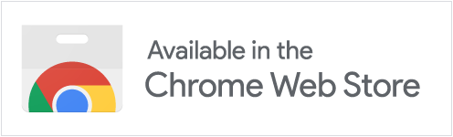

# Clone Blocker

**English** · [Tiếng Việt](README.md)

Somebody has copied your Facebook or Threads account — your photo, your name,
your bio — and is using it to ask your friends for money. You block them. A week
later there are three more.

Clone Blocker blocks them for you, and everybody else running it blocks them
too.

  <a href="https://chromewebstore.google.com/detail/clone-blocker/mlkbihlabbmjdhmadjkijioafknfnmaj"><b>Install — free</b></a>

  

  <a href="https://cloneblocker.tree55.com/">Website</a> ·
  <a href="https://cloneblocker.tree55.com/list">Public list</a> ·
  <a href="https://cloneblocker.tree55.com/privacy">Privacy</a> ·
  <a href="https://cloneblocker.tree55.com/faq">FAQ</a>

---

## Install

**[Install from the Chrome Web Store](https://chromewebstore.google.com/detail/clone-blocker/mlkbihlabbmjdhmadjkijioafknfnmaj)** — free

That is the whole setup. There is no address to enter, no account to create and
no permission prompt to accept. It starts working the next time you open
Facebook or Threads, in Vietnamese if that is what Chrome is running in and in
English otherwise.

Requires Chrome 120 or newer.

Installing from source instead

Open `chrome://extensions`, turn on **Developer mode**, choose **Load
unpacked**, and select this directory. Everything above applies the same way.

## What it does

**It blocks clones for real.** Not hides them, not reports them and hopes —
blocks them, through Facebook's and Threads' own block, exactly as if you had
done it by hand. It never uses an SDK or an API key, and it never asks for your
password.

**One report protects everybody.** When you report a clone, a person reads it.
If they approve it, that account joins a shared list and every installation
blocks it — including yours, before you ever run into them.

**It is careful on your behalf.** Blocking hundreds of accounts in an afternoon
is how a real account gets locked. So it works slowly, a few an hour, spaced out,
and stops entirely if the site starts asking questions. You will barely notice it
running.

## Using it

There are two tick boxes, both on to start with, and neither is the other's
alternative:

- **Block clones I run into** — profiles that appear on your screen while you
  browse. They were in front of you anyway, so blocking them looks like ordinary
  use.
- **Work through the list too** — accounts from the shared list that you have not
  met yet. Slower and more cautious, because these were never on your screen.

**To report a clone:** open their profile, or find one of their posts, and press
the block button Clone Blocker adds next to *Share*. Pick a reason, send.
*Block this profile too* is already ticked, so it goes at once.

**Hiding** is a separate extra, off by default: it makes listed accounts
disappear from your feed without touching your account at all.

Everything else — how fast it works, which kinds of account it blocks, what
language it speaks — is in Settings, and none of it needs your attention.

## What it sends

Nothing, until you report someone. Fetching the list tells the server nothing
about you at all — not your time zone, not your language, not who you are.

A report carries what you typed and a pseudonym of your account, hashed in your
browser with a secret that never leaves it. Your real account ID never goes
anywhere. Nobody who reads your report can work out who you are, and neither can
anybody who steals the whole store of them.

The full policy is [PRIVACY.md](PRIVACY.md), and it is written to be read.

## Honest caveats

- **It cannot block anybody while no Facebook or Threads tab is open.** Blocking
  is done by the sites' own code, and that code only exists in their pages.
- **It cannot promise a clone stays blocked.** People make new accounts. The
  shared list is what makes that a losing game for them rather than for you.
- **A report is not a block.** Reports go to a person, and that person may say
  no. Nothing you report is blocked for anybody else automatically.
- **Meta changes their site constantly.** When something breaks, it breaks
  quietly — which is why the extension tells you what it did rather than
  assuming it worked.

## For developers

| | |
|---|---|
| [How blocking works](docs/BLOCKING.md) | Driving the site's own code, which identifier is used, and working the queue with no tab open |
| [Choosing whom to block first](docs/RANKING.md) | Ranking, entirely inside your browser |
| [Architecture](docs/ARCHITECTURE.md) | How the pieces fit, and where each file lives |
| [Development](docs/DEVELOPMENT.md) | Tests, and how a release is built |
| [Research](docs/RESEARCH.md) | Why no SDK, and what is used instead |
| [Changelog](CHANGELOG.md) | What changed and when |

The server and the moderation dashboard are not open source, so their
documentation is not public. Everything that runs in your browser is in
this repository.

No Facebook or Threads SDK, and no Graph API. It works by using the sites' own
internal JavaScript — the module registry, the Relay runtime and the Relay store
— from a `MAIN`-world content script.

## Licence

MIT. See [LICENSE](LICENSE).
